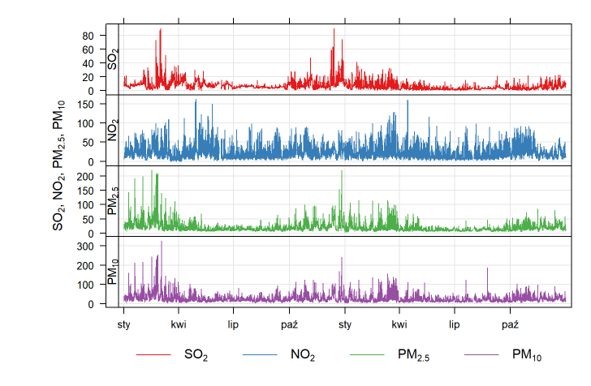
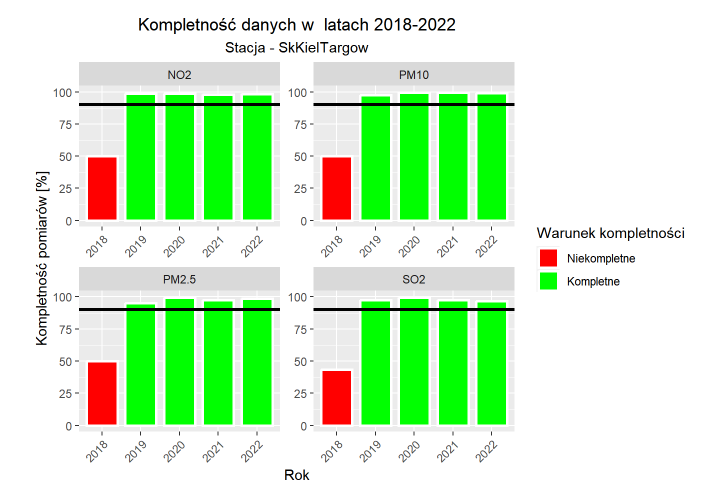
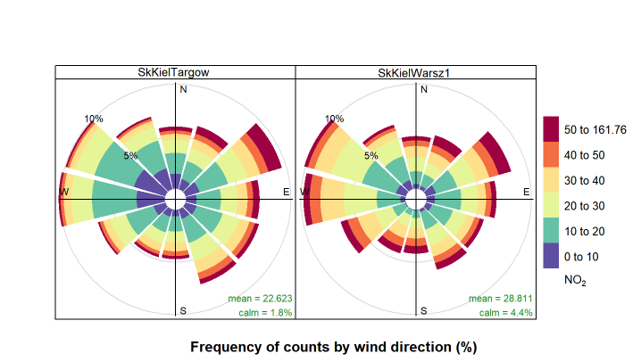

#  Air Quality Analysis in R 

This project, developed for the Methodology of Environmental Research and Analysis course, involves analysis of air quality using R Quarto. The analysis generates an interactive HTML report containing results, visualizations, and insights based on environmental data.

## Project Files:

- **projekt.qmd** – The main Quarto file containing R code and analysis.

- **proj.RData** – RData file used to store the R environment and workspace.

- **projekt.html** – The final HTML output generated from the projekt.qmd file, containing all the analysis results and visualizations.

- **projekt.rar** – A compressed archive containing:
  - **projekt_files/** – A folder containing any external resources or assets needed for the analysis.
  - **projekt_cache/** – A folder generated by Quarto that stores temporary files and cache for the analysis.

## How to View the Report

To view the generated HTML report, simply download and extract **projekt.rar** and **projekt.html**. Ensure all extracted files are in the same directory, then open **projekt.html** in your web browser.

## How to Reproduce the Report

To generate the report from scratch in RStudio, follow these steps:

### 1. Install Required Packages

Ensure you have the necessary R packages installed. Run the following command in R:

```r
install.packages(c(
  "knitr", "giosimport", "tidyverse", "lubridate", "openair", "leaflet", "openxlsx",
  "devtools", "purrr", "ggplot2", "dplyr", "worldmet", "DT", "gridExtra"
))

devtools::install_github("davidcarslaw/openair")
devtools::install_github("mrzeszut/giosimport")
```

### 2. Open the Project in RStudio

Open RStudio and set the working directory to the project location:

```r
setwd("/path/to/your/project")
```

### 3. Load the Workspace 

If needed, load the saved R environment:

```r
load("proj.RData")
```

### 4. Render the Report

Use Quarto to render the **projekt.qmd** file:

```r
library(quarto)
quarto::quarto_render("projekt.qmd")
```

This will generate a new **projekt.html** file containing the updated analysis and visualizations.

## Installing R, RStudio, and Quarto

If you don’t have R, RStudio, or Quarto installed, follow these steps to set up your environment:

### 1. Install R

Download the latest version of R from CRAN and install it following the instructions for your operating system (Windows, macOS, or Linux).

### 2. Install RStudio

Download RStudio Desktop from Posit (formerly RStudio) and install it.

### 3. Install Quarto

Download and install Quarto from Quarto’s official website.

Verify the installation by running the following command in the terminal or command prompt:

```bash
quarto --version
```

After completing these steps, follow the instructions in the **How to Reproduce the Report** section to generate the report in RStudio. 

## Sample Plots

Below are some example plots generated in the analysis:








